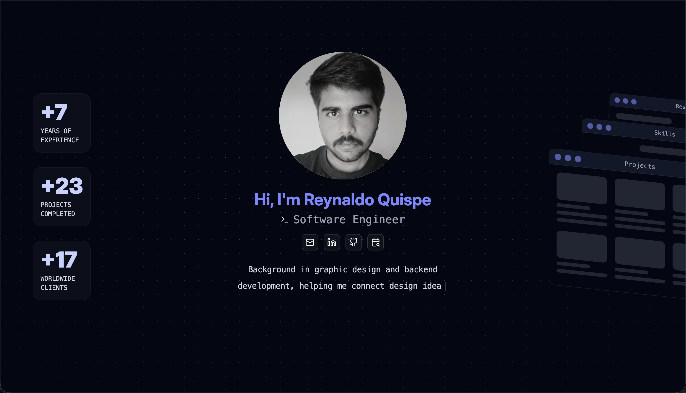

# Portfolio - Personal Portfolio Website



A modern, interactive portfolio website showcasing my skills, projects, and professional experience. Built with cutting-edge web technologies and featuring smooth animations, responsive design, and an elegant glassmorphism UI.

🔗 **Live Demo**: [https://reynaldoqs.github.io/portfolio_spa](https://reynaldoqs.github.io/portfolio_spa)

## ✨ Features

- **Interactive UI**: Smooth animations powered by GSAP
- **Responsive Design**: Mobile-first approach with pixel-perfect layouts
- **Modern Aesthetics**: Glassmorphism effects and radial gradient backgrounds
- **PDF Resume Viewer**: Integrated PDF viewer for resume display
- **Component Architecture**: Organized using Atomic Design principles (Atoms, Molecules, Organisms)
- **Type-Safe**: Full TypeScript implementation
- **Optimized Performance**: Built with Vite and React Compiler for blazing-fast performance
- **SEO Optimized**: Proper meta tags and semantic HTML structure

## 🛠️ Technologies Used

### Core Framework & Build Tools
- **[React 19.2.0](https://react.dev/)** - Latest React with concurrent features
- **[TypeScript 5.9.3](https://www.typescriptlang.org/)** - Type-safe JavaScript
- **[Vite (Rolldown)](https://vite.dev/)** - Next-generation frontend tooling with Rolldown bundler
- **[React Compiler](https://react.dev/learn/react-compiler)** - Automatic React optimization

### Styling & UI
- **[Tailwind CSS 4.1.18](https://tailwindcss.com/)** - Utility-first CSS framework
- **[Radix UI](https://www.radix-ui.com/)** - Unstyled, accessible UI components
- **[Lucide React](https://lucide.dev/)** - Beautiful & consistent icon set
- **[Class Variance Authority](https://cva.style/docs)** - Component variant management
- **[tw-animate-css](https://www.npmjs.com/package/tw-animate-css)** - Tailwind animation utilities

### Animation & Interactions
- **[GSAP 3.14.2](https://gsap.com/)** - Professional-grade animation library
- **[@gsap/react](https://gsap.com/docs/v3/React/)** - React integration for GSAP

### Document Handling
- **[React PDF](https://react-pdf.org/)** - PDF viewer component
- **[PDF.js](https://mozilla.github.io/pdf.js/)** - PDF rendering engine

### Development Tools
- **[Biome](https://biomejs.dev/)** - Fast formatter and linter
- **[pnpm](https://pnpm.io/)** - Efficient package manager
- **[vite-plugin-webfont-dl](https://github.com/feat-agency/vite-plugin-webfont-dl)** - Google Fonts optimization

### Deployment
- **[GitHub Pages](https://pages.github.com/)** - Static site hosting
- **[gh-pages](https://www.npmjs.com/package/gh-pages)** - Automated deployment

## 📁 Project Structure

```
portfolio/
├── src/
│   ├── components/
│   │   ├── atoms/          # Basic building blocks (Button, Badge, Logo, etc.)
│   │   ├── molecules/      # Composite components (HeroSection, ProjectCard, etc.)
│   │   └── organisms/      # Complex components (Projects, Skills, Resume, etc.)
│   ├── constants/
│   │   └── profile.ts      # Centralized data (skills, projects, statistics)
│   ├── views/
│   │   └── Home.tsx        # Main page layout
│   ├── assets/
│   │   └── images/         # Images and media files
│   ├── lib/
│   │   └── utils.ts        # Utility functions
│   ├── App.tsx             # Root component
│   ├── main.tsx            # Application entry point
│   └── index.css           # Global styles and Tailwind directives
├── public/                 # Static assets
├── dist/                   # Production build output
└── portfolio.png           # Preview image
```

## 🚀 Getting Started

### Prerequisites

- **Node.js** 18+ 
- **pnpm** (recommended) or npm

### Installation

1. Clone the repository:
```bash
git clone https://github.com/reynaldoqs/portfolio_spa.git
cd portfolio_spa
```

2. Install dependencies:
```bash
pnpm install
```

3. Start the development server:
```bash
pnpm dev
```

4. Open [http://localhost:5173](http://localhost:5173) in your browser

### Build for Production

```bash
pnpm build
```

The optimized production build will be in the `dist/` directory.

### Preview Production Build

```bash
pnpm preview
```

### Deploy to GitHub Pages

```bash
pnpm deploy
```

## 🎨 Design Principles

- **Atomic Design**: Components are organized into atoms, molecules, and organisms for maximum reusability
- **Mobile-First**: Responsive layouts that work seamlessly across all devices
- **Glassmorphism**: Modern UI aesthetic with frosted glass effects
- **Performance**: Optimized with React Compiler and Vite for instant page loads
- **Accessibility**: Built with Radix UI primitives for keyboard navigation and screen reader support

## 📊 Key Components

### Atoms
- `Button` - Reusable button component with variants
- `Badge` - Skill and technology badges
- `Logo` - Animated logo component
- `PageHeader` - Section headers with interactive elements
- `GlassContainer` - Glassmorphism container wrapper

### Molecules
- `HeroSection` - Landing section with introduction
- `ProjectCard` - Individual project showcase cards
- `Statistics` - Experience metrics display
- `PageCarousel` - Carousel navigation component

### Organisms
- `Projects` - Projects gallery with filtering
- `Skills` - Skills matrix with experience levels
- `Resume` - PDF resume viewer
- `OverviewCarousel` - Multi-page content carousel

## 🔧 Configuration

### TypeScript
Strict mode enabled with modern ES2022 target and bundler module resolution.

### Tailwind CSS
Custom configuration with dark mode, animations, and glassmorphism utilities.

### Vite
Configured with React plugin, Tailwind integration, and Google Fonts optimization.

## 📝 License

This project is open source and available for reference. Feel free to fork and customize for your own portfolio!

## 👤 Author

**Reynaldo Quispe**
- Email: rey.quispe@outlook.com
- LinkedIn: [linkedin.com/in/rey-quispe](https://linkedin.com/in/rey-quispe)
- GitHub: [github.com/rey-quispe](https://github.com/rey-quispe)
- Schedule a call: [calendly.com/rey-quispe](https://calendly.com/rey-quispe)

---

Built with ❤️ using React, TypeScript, and Tailwind CSS
